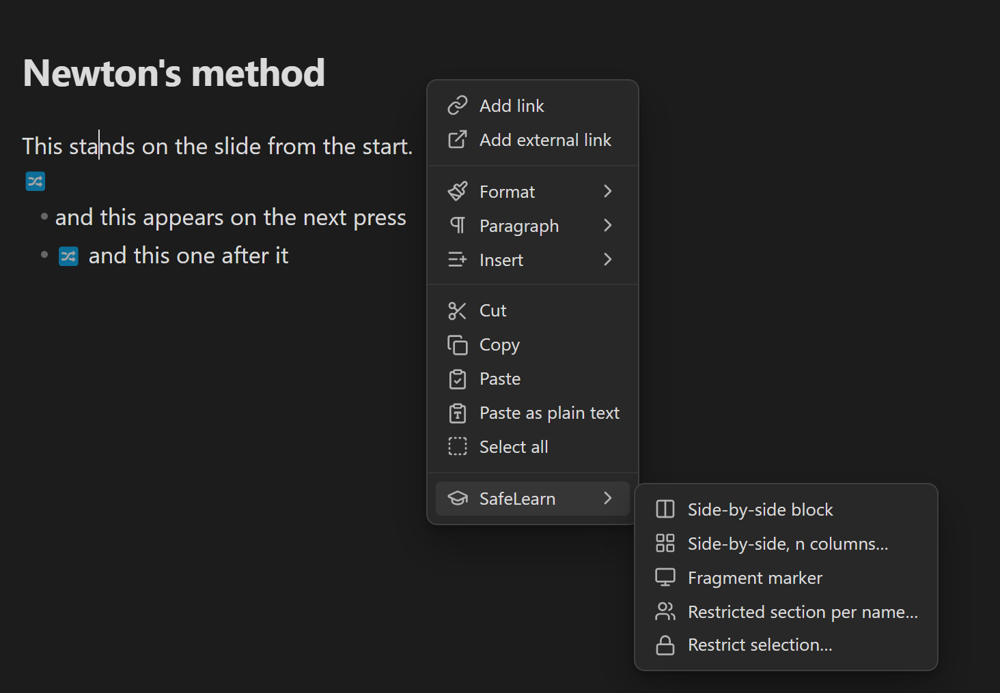
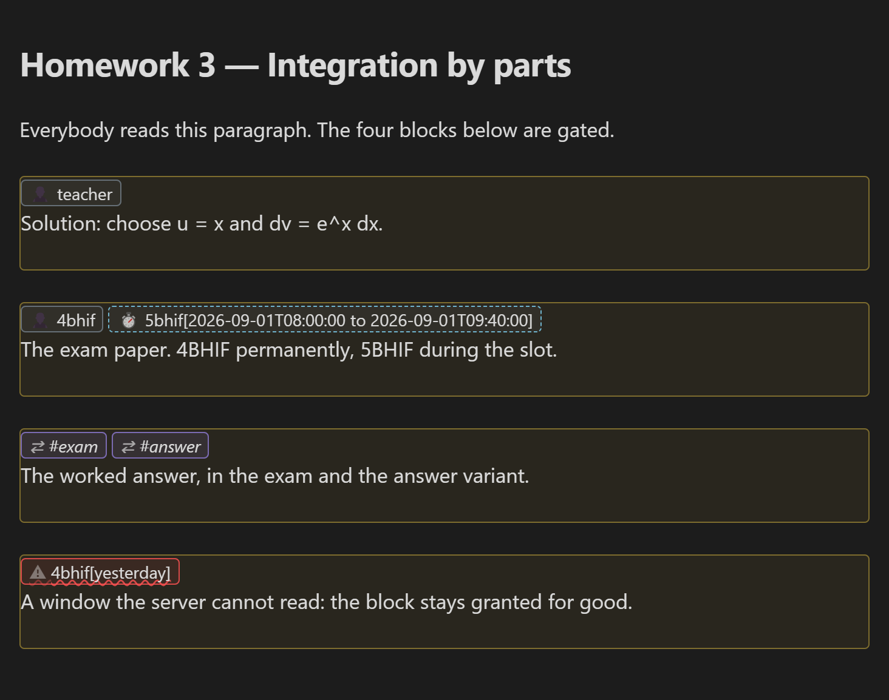
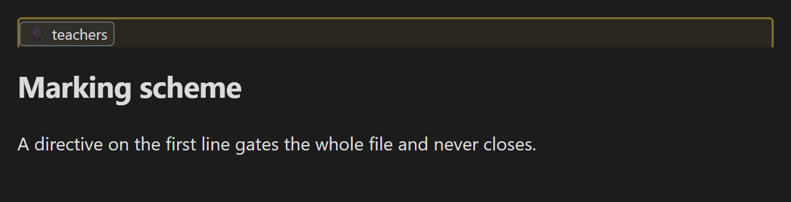
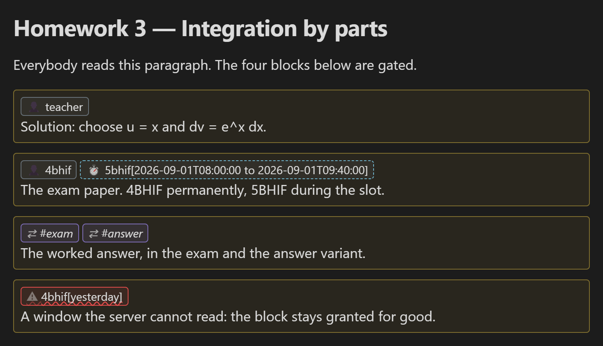
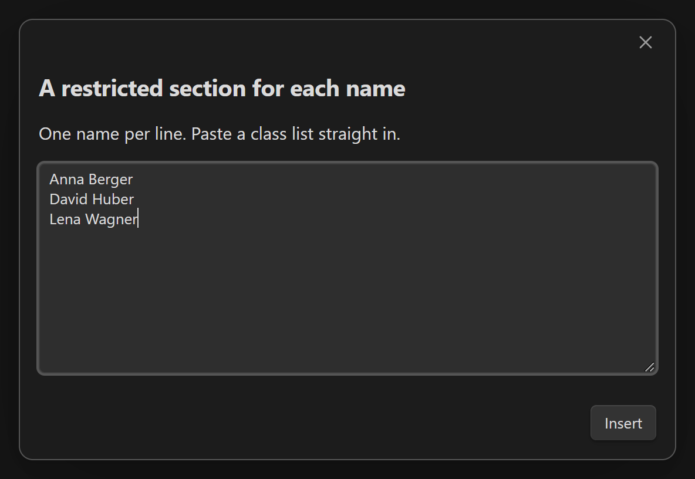
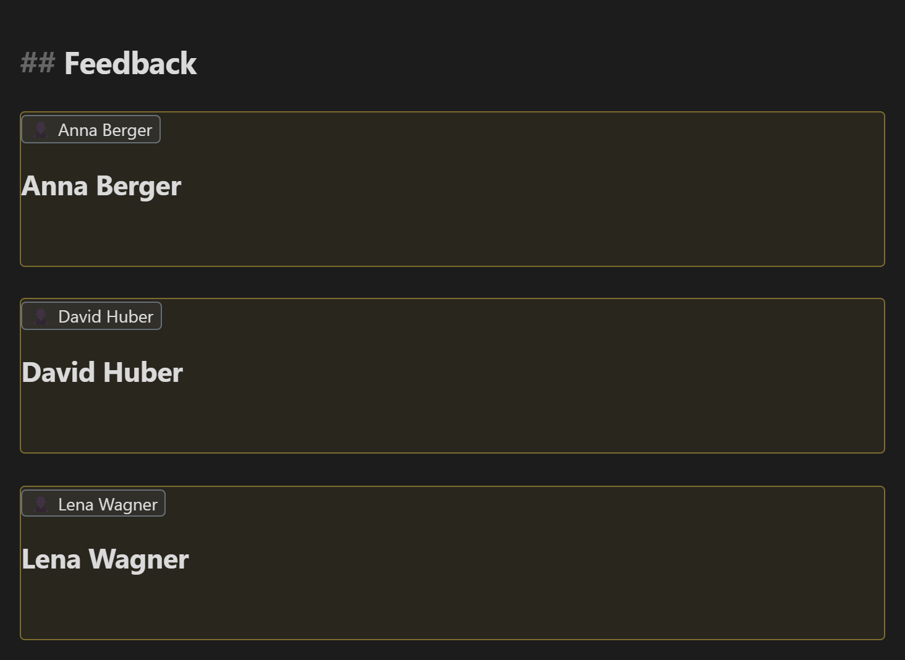
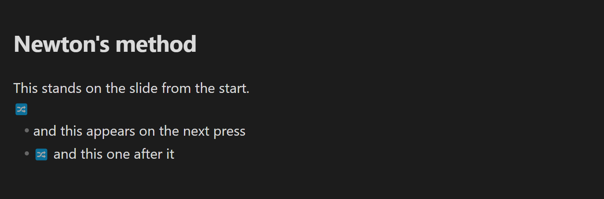
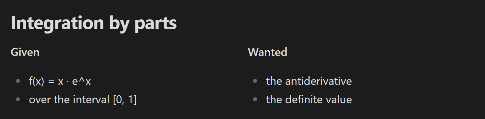

# SafeLearn Formatter for Obsidian

Shows what [SafeLearn](https://github.com/UnterrainerInformatik/safeLearn) will do with your document while you write it.

SafeLearn is an open-source server that publishes a teacher's Markdown behind a school login. It reads a few tags of its own — who may read a block, what appears step by step in a presentation, what stands in columns. Those tags are instructions to the server, not text anyone is meant to read. This plugin takes them out of the way and puts what they *mean* in their place. **It never changes your file.**

## Install

Settings → **Community plugins** → **Browse** → search for *SafeLearn Formatter* → **Install**, then **Enable**.

Nothing to configure. No settings, no account, no network.

## Write the tags from the menu

Right-click in the editor and open **SafeLearn**. The same five are in the command palette, under *SafeLearn Formatter*.

| Command | What it writes |
| --- | --- |
| **Side-by-side block** | Two columns. |
| **Side-by-side, n columns…** | Asks how many, defaults to three. |
| **Fragment marker** | `##fragment` above the block the cursor is in. |
| **Restricted section per name…** | One restricted block per name — paste a class list. |
| **Restrict selection…** | Wraps the selection in a directive. |

With text selected, a side-by-side command encloses it whole and puts the separator after it. Every marker lands on a line of its own.

## Restricted blocks — `@@@`

`@@@ teacher` opens a block only that reader sees, `@@@` on its own closes it. The directive line stands as the block's heading, and every entry in it is shown as what it *is*:

| Marking | Meaning |
| --- | --- |
| Plain chip | A permanent grant. |
| Dashed chip, stopwatch | Carries a time window — the block appears or disappears with nobody editing it. It never changes with the clock: a window that has closed looks like one that has not opened. |
| Red chip, warning | A window SafeLearn **cannot read**. It drops the window and keeps the entry, so the block is granted permanently. Nothing else anywhere tells you. |
| Italic chip, arrows | A view switch (`#exam`, `#practice`, `#answer`) — a variant of the document, not an audience. |
| Struck through | An entry SafeLearn discards entirely. |

Windows are reproduced exactly as you wrote them, never restated in words — a readable restatement would make a window sound that the server throws away.

**Put the cursor in the line and the characters are back**, editable, while the other blocks keep their headings:

A directive on the **first line** gates the whole file. It has no closing marker, so its frame is drawn with the lower edge left off:

Reading view: the tags are gone, the headings remain.

### A section per student

*Restricted section per name…* takes a pasted class list and writes one block per person, each with a heading **inside** the block — a heading above it would show every student the names of all the others.

Five names are reserved (`admin`, `teacher`, `teachers`, `student`, `students`): SafeLearn reads them as *roles*, so a section for a student called `Students` is read by the whole school. The command writes your names unchanged and tells you when one of them was such a name.

## Fragments — `##fragment`

Content that appears one step at a time in a Reveal.js presentation. The tag is shown as an icon, and is its own characters again with the cursor in it.

## Columns — `##side-by-side-start`

The block is drawn as the region it is while you write, and rebuilt as the columns the server makes of it when you read. (The widths are not Reveal's and are not meant to be.)

## Good to know

* **Obsidian 1.5.7 or later.** No external dependencies, desktop and mobile.
* **The plugin enforces nothing.** It is purely visual — every permission is decided by your SafeLearn server.
* **It marks exactly what the server acts on**, no more: the rules are taken from SafeLearn's own parser, and a check in the [SafeLearn repository](https://github.com/UnterrainerInformatik/safeLearn) runs both over the same directives. From a SafeLearn checkout: `npm run test:obsidian`.

## License

[The Unlicense](https://github.com/UnterrainerInformatik/safeLearn-Obsidian-plugin#Unlicense-1-ov-file)
